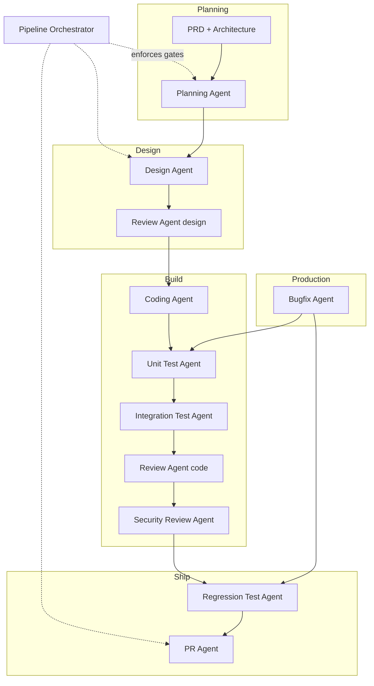

# Development Pipeline Agents

Production-grade Cursor skills for the full SDLC: planning → design → coding → testing → review → security → PR, with Jira integration and enterprise gate enforcement.

All agents live under `.cursor/skills/<agent-name>/SKILL.md`.

## Configuration

| File | Purpose |
|------|---------|
| [.docs/TESTING.md](../../.docs/TESTING.md) | Spring Boot Maven test setup + pom snippets |
| [`project-config.yml`](../../project-config.yml) | **Single project config** — edit project + epic fields in one file |
| [.github/workflows/ci.yml](../../.github/workflows/ci.yml) | CI template — copy with `.github/scripts/load-project-config.py` |
| [.docs/PROJECT-CONFIG.md](../../.docs/PROJECT-CONFIG.md) | Field reference and copy-to-new-repo guide |
| [jira-integration.md](jira-integration.md) | Jira epics/stories + wiki links in comments |
| [wiki-integration.md](wiki-integration.md) | **All documents stored in GitHub Wiki under epic** |
| [report-persistence.md](report-persistence.md) | Wiki publish workflow + optional repo mirror |
| [MCP-SETUP.md](../../.docs/MCP-SETUP.md) | Configure Jira + GitHub Wiki MCP |

## Document model

| System | Role |
|--------|------|
| **Jira** | Epics, stories, status, assignee — updated with **wiki links** |
| **GitHub Wiki** | PRD, architecture, design, agent reports — under `Projects/{slug}/Epics/{EPIC-KEY}/` |
| **GitHub repo** | Code, CI, optional mirror of reports |

## Agent Pipeline



## Agents

| Agent | Skill path | Trigger |
|-------|------------|---------|
| **Orchestrator** | [pipeline-orchestrator-agent/](pipeline-orchestrator-agent/) | Validate gates or get next step |
| Planning | [planning-agent/](planning-agent/) | PRD + architecture; creates Jira epic/stories |
| Design | [design-agent/](design-agent/) | After planning gate PASS |
| Review | [review-agent/](review-agent/) | Design, code, tests, bugfix (`scope=design\|code\|tests`) |
| Coding | [coding-agent/](coding-agent/) | After design review approved |
| Unit Test | [unit-test-agent/](unit-test-agent/) | After code changes |
| Integration Test | [integration-test-agent/](integration-test-agent/) | After unit tests; API/DB changes |
| Security Review | [security-review-agent/](security-review-agent/) | Before regression; mandatory in strict mode |
| Regression Test | [regression-test-agent/](regression-test-agent/) | CI pipeline; mandatory in strict mode |
| PR | [pr-agent/](pr-agent/) | All gates pass |
| Bugfix | [bugfix-agent/](bugfix-agent/) | Jira bug link (mandatory in production) |

## Pipeline modes

| Mode | Gates | Notes |
|------|-------|-------|
| `dev` (default) | Relaxed via `pipeline.environments.dev.gates` | Jira required for Planning; wiki recommended |
| `strict` | All `pipeline.gates.*.mandatory_in_strict: true` enforced | Full gate chain through PR; see orchestrator |

Set in [`project-config.yml`](../../project-config.yml) → `pipeline.mode`.

## Usage

Invoke by skill name in Cursor:

```
@pipeline-orchestrator-agent
@planning-agent
@design-agent
@coding-agent
@review-agent
@unit-test-agent
@integration-test-agent
@security-review-agent
@regression-test-agent
@pr-agent
@bugfix-agent
```

## Integrate into a new project

Copy this **bundle** into your **application repository** (not just the agents template repo):

```bash
# From the agents template repo root:
./.scripts/copy-pipeline-bundle.sh /path/to/your-app
```

<details>
<summary>Manual copy (equivalent commands)</summary>

```bash
APP=/path/to/your-app
mkdir -p "$APP/.github/workflows" "$APP/.github/scripts" "$APP/.docs/agent-reports"

rsync -a --exclude='node_modules' .cursor/ "$APP/.cursor/"
cp project-config.yml "$APP/project-config.yml"
cp .docs/TESTING.md .docs/PROJECT-CONFIG.md .docs/MCP-SETUP.md .docs/maven-profiles.example.xml "$APP/.docs/"
cp .docs/agent-reports/README.md "$APP/.docs/agent-reports/"
cp .github/workflows/ci.yml "$APP/.github/workflows/ci.yml"
cp .github/scripts/load-project-config.py "$APP/.github/scripts/"
```

</details>

**Template repo only:** `.scripts/` is not copied to the app repo — run `./.scripts/copy-pipeline-bundle.sh` from this agents template checkout. The app gets `.cursor/`, `project-config.yml`, `.docs/`, and `.github/`.

Then edit `$APP/project-config.yml` (`project`, `github`, `jira`, `build`, `security`).

### Integration checklist

| Step | Action | Required for strict mode |
|------|--------|--------------------------|
| 1 | Copy bundle above into app repo | Yes |
| 2 | Edit `project-config.yml` — project fields once; `jira.epic_key` per epic (`pipeline.mode: dev` is default) | Yes |
| 3 | Set shell env vars + restart Cursor MCP — [MCP-SETUP.md](../../.docs/MCP-SETUP.md) (**required before `@planning-agent`**) | Yes |
| 4 | Enable GitHub Wiki on app repo | Yes |
| 5 | Set Jira transition IDs in `jira.transitions` (null = comment only until set) | Recommended |
| 6 | Merge `.docs/maven-profiles.example.xml` into `pom.xml` — [TESTING.md](../../.docs/TESTING.md) | Yes (Maven) |
| 7 | Install local security tools: `gitleaks`, `semgrep` | Yes |
| 8 | Set GitHub branch protection: require `ci-success` check | Recommended |
| 9 | Switch `pipeline.mode` to `strict` after steps 3–8 pass | Yes |

### Gate report lookup (wiki-first)

Agent reports live on **GitHub Wiki** under `Projects/{slug}/Epics/{EPIC-KEY}/Agent-Reports/`. Design, Orchestrator, and PR agents verify prior gates from wiki (or Jira comment links), not `.docs/agent-reports/` unless `mirror_to_repo: true`. See [report-persistence.md](report-persistence.md).

### Flow through PR merge

```
Planning → Design → Review(design) → Coding → Unit → Integration
  → Review(code) → Security → Regression(CI) → PR → merge
```

1. Push feature branch before `@regression-test-agent`
2. `@pr-agent` creates PR and waits for `gh pr checks` (`ci-success` PASS) in strict mode
3. Human merges when CI green

**Stack note:** CI template targets **Maven/Java 21** only. Gradle projects need a custom workflow; agents assume Maven commands from `project-config.yml` → `build.*`.

## Jira + Wiki setup

1. Edit [`project-config.yml`](../../project-config.yml) — project fields once; `jira.epic_key` per epic
2. Configure **Jira MCP** + **github-wiki MCP** — see [MCP-SETUP.md](../../.docs/MCP-SETUP.md)
3. Env vars: `ATLASSIAN_*`, `GITHUB_TOKEN`
4. Align transition IDs in `project-config.yml` → `jira.transitions`

## Typical workflow

```
1. Human provides PRD + architecture content
2. Planning Agent         → Jira epic/stories + publish PRD/Architecture to wiki
3. Design Agent           → publish Designs/{STORY-KEY} per story; Jira stories get their design wiki links
4. Review Agent (design)  → report to wiki; APPROVED → Ready for Dev
5. Coding Agent           → implementation; report to wiki
6. Unit Test Agent        → report to wiki
7. Integration Test Agent → report to wiki (API changes)
8. Review Agent (code)    → report to wiki
9. Security Review Agent  → report to wiki
10. Regression Agent      → report to wiki + CI link on Jira
11. PR Agent              → PR with wiki URLs for all docs/reports
12. Bugfix Agent          → prod hotfix; report to wiki; Jira bug gets wiki link
```

All documents live under: `Projects/{slug}/Epics/{EPIC-KEY}/` on GitHub Wiki.

Use `@pipeline-orchestrator-agent` to verify gates before each phase.

## Audit trail

Documents and reports are published to **GitHub Wiki** under the epic. Jira issues receive wiki links. Optional repo mirror: `.docs/agent-reports/`. See [.docs/agent-reports/README.md](../../.docs/agent-reports/README.md).
