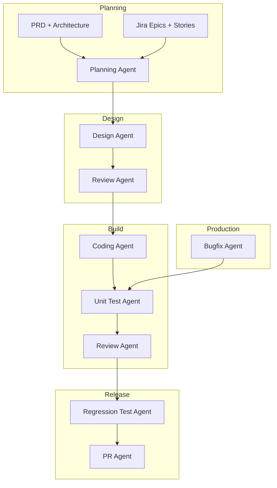

# Development Pipeline Agents

Production-grade Cursor skills for the full SDLC: planning → design → coding → testing → review → release, with Jira integration.

All agents live under `.cursor/skills/<agent-name>/SKILL.md`.

## Agent Pipeline



## Agents

| Agent | Skill path | Trigger |
|-------|------------|---------|
| Planning | [planning-agent/](planning-agent/) | PRD + architecture; creates Jira epic/stories |
| Design | [design-agent/](design-agent/) | After planning gate |
| Coding | [coding-agent/](coding-agent/) | After design review approved |
| Review | [review-agent/](review-agent/) | After design, coding, testing, bugfix |
| Unit Test | [unit-test-agent/](unit-test-agent/) | After code changes |
| Regression Test | [regression-test-agent/](regression-test-agent/) | CI pipeline link (optional) |
| Bugfix | [bugfix-agent/](bugfix-agent/) | Jira bug link (mandatory in production) |
| PR | [pr-agent/](pr-agent/) | Review + tests pass |

**Shared Jira contract:** [jira-integration.md](jira-integration.md)

## Usage

Invoke by skill name in Cursor:

```
@planning-agent
@design-agent
@coding-agent
@review-agent
@unit-test-agent
@regression-test-agent
@bugfix-agent
@pr-agent
```

## Jira setup

1. Configure **Jira MCP** in Cursor, or set env vars: `JIRA_URL`, `JIRA_EMAIL`, `JIRA_API_TOKEN`
2. Align transition names in [jira-integration.md](jira-integration.md) with your Jira workflow

## Typical workflow

```
1. Human writes PRD + architecture
2. Planning Agent    → creates Jira epic/stories + validates
3. Design Agent      → tech design + traceability matrix
4. Review Agent      → design review
5. Coding Agent      → implementation
6. Unit Test Agent   → tests
7. Review Agent      → code review
8. Regression Agent  → CI result (if link provided)
9. PR Agent          → PR opened
10. Bugfix Agent     → prod hotfix (Jira mandatory)
```
