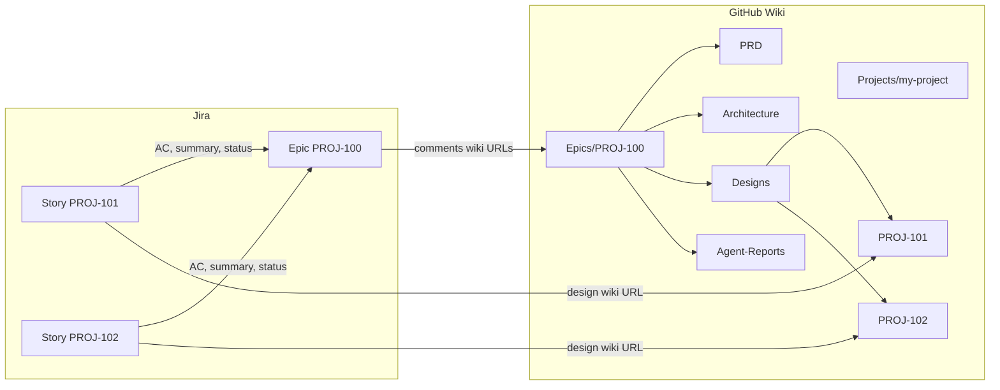

# GitHub Wiki Integration (Shared)

**Canonical document store:** all PRD, architecture, technical designs, and agent reports live in the **GitHub Wiki** under the project epic. **Jira** holds epics and stories only; every Jira update includes wiki links.

## Architecture



| System | Stores | Does not store |
|--------|--------|----------------|
| **GitHub Wiki** | PRD, architecture, per-story designs, agent reports | Issue workflow state, user story / AC text |
| **Jira** | Epic, stories, status, assignee, AC, user story text | Full document bodies (PRD, design) |

## Configuration

Read [project-config.yml](../../project-config.yml) (see [PROJECT-CONFIG.md](../../.docs/PROJECT-CONFIG.md)).

| Field | Example | Use |
|-------|---------|-----|
| `github.owner` | `myorg` | GitHub org or user |
| `github.repo` | `my-repo` | Repo with wiki enabled |
| `project.slug` | `my-project` | Wiki folder under `Projects/` |
| `project.name` | `My Project` | Display name |
| `jira.epic_key` | `PROJ-100` | Set per run or from Jira |
| `wiki.base_path` | `Projects/my-project/Epics` | Epic root (auto-derived from `project.slug`) |
| `wiki.pages.designs` | `Designs` | Folder for per-story design pages |

**MCP:** Configure `github-wiki` server in `.cursor/mcp.json` (see [MCP-SETUP.md](../../.docs/MCP-SETUP.md)).

## Wiki page tree (per epic)

```
Projects/<project-slug>/
└── Epics/<EPIC-KEY>/                 # e.g. Epics/PROJ-100
    ├── PRD
    ├── Architecture
    ├── Designs/                      # one technical design per story (like Agent-Reports)
    │   ├── PROJ-101.md
    │   ├── PROJ-102.md
    │   └── ...
    └── Agent-Reports/
        ├── planning-agent-20260716.md
        ├── design-agent-20260716.md
        ├── review-agent-20260716.md
        └── ...
```

Per-story design pages live under `Designs/{STORY-KEY}.md`. Story metadata (user story, AC, DoD) stays in **Jira** — Planning Agent does not create wiki pages for story text.

## Wiki URL format

```
https://github.com/{owner}/{repo}/wiki/Projects/{slug}/Epics/{EPIC-KEY}/Designs/{STORY-KEY}
```

Encode spaces as hyphens in page names. Subpages use `/` in the path when using folder-style naming.

## Agent workflow (every document-writing agent)

1. **Write content** to markdown (in memory or temp)
2. **Publish to wiki** via `github-wiki` MCP:
   - `write_wiki_page` or `append_to_wiki_page`
   - `owner`, `repo` from `project-config.yml` → `github`
   - `pageName`: full path e.g. `Projects/my-project/Epics/PROJ-100/Designs/PROJ-101`
3. **Build wiki URL** from config + page path
4. **Update Jira** — comment on epic and/or story with wiki link (required)
5. **Optional:** mirror to `.docs/` in repo for git audit (when `project-config.yml` → `pipeline.reporting.mirror_to_repo: true`)

## Jira comment format (required)

Every agent comment on Jira must include wiki links:

```markdown
## [Agent Name] Report — [timestamp]

**Status:** PASS | COMPLETE | FAIL

**Wiki:**
- PRD: https://github.com/org/repo/wiki/Projects/my-project/Epics/PROJ-100/PRD
- Design (PROJ-101): https://github.com/org/repo/wiki/Projects/my-project/Epics/PROJ-100/Designs/PROJ-101
- Report: https://github.com/org/repo/wiki/Projects/my-project/Epics/PROJ-100/Agent-Reports/planning-agent-20260716

**Jira:** PROJ-100 (epic) | PROJ-101 (story)
```

### What to link per artifact

| Artifact | Wiki page | Jira target |
|----------|-----------|-------------|
| PRD | `.../Epics/{KEY}/PRD` | Epic + all stories |
| Architecture | `.../Epics/{KEY}/Architecture` | Epic + all stories |
| Technical design | `.../Epics/{KEY}/Designs/{STORY-KEY}` | That story (+ epic index comment) |
| Agent report | `.../Epics/{KEY}/Agent-Reports/{agent}-{date}` | Epic or story |

Story details (user story, AC, DoD) are stored in **Jira only** — Planning Agent does not create wiki pages under `Stories/`.

### Jira description update (on create)

When Planning Agent creates a story, set description to include epic wiki links and full story text in Jira:

```markdown
## Wiki
- Epic (Jira): PROJ-100
- PRD: https://github.com/.../wiki/Projects/.../Epics/PROJ-100/PRD
- Architecture: https://github.com/.../wiki/Projects/.../Epics/PROJ-100/Architecture

## User story
...
```

Design links are added by Design Agent after each `Designs/{STORY-KEY}` page is published.

## Planning Agent specifics

1. Create Jira epic + stories (story details in Jira description)
2. Publish PRD → `.../PRD`
3. Publish Architecture → `.../Architecture`
4. Comment epic with PRD, Architecture wiki URLs
5. Comment each story with PRD, Architecture wiki URLs — **no** design pages yet

## Design Agent specifics

1. For **each** Jira story in scope, publish technical design → `.../Designs/{STORY-KEY}` (e.g. `Designs/PROJ-101`)
2. Each page covers domain model, APIs, components, and traceability **for that story**
3. Comment **each story** with its own `Designs/{STORY-KEY}` wiki URL + design report URL
4. Comment epic with index of all design page URLs and traceability summary

## Report agents (review, test, coding, etc.)

1. Publish report → `.../Agent-Reports/{agent}-{YYYYMMDD}.md`
2. Comment linked Jira issue with report wiki URL only (not repo path)

## Authentication

| Priority | Method |
|----------|--------|
| 1 | `github-wiki` MCP tools |
| 2 | GitHub API with `GITHUB_TOKEN` (repo + wiki scope) |
| 3 | Stop — report blocker; do not fabricate wiki URLs |

## Rules

- **Wiki is canonical** for all documents in strict mode
- **Jira always gets wiki links** — never repo-only links in Jira comments
- Epic key in wiki path must match Jira epic key (e.g. `PROJ-100`)
- Design page filename must match Jira story key (e.g. `Designs/PROJ-101`)
- Do not store full PRD/design body in Jira description — link to wiki; keep AC summary in Jira
- If wiki publish fails, FAIL the agent report and do not mark Jira PASS
