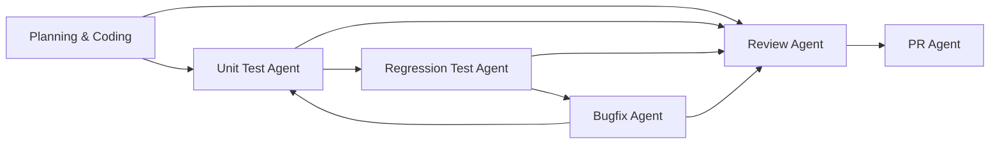

# Development Pipeline Agents

Specialized Cursor agents for the planning → coding → testing → review → release workflow.

## Agent Pipeline



## Agents

| Agent | Directory | Trigger |
|-------|-----------|---------|
| Review | [review/](review/) | After planning, coding, testing, or bugfix phases |
| Unit Test | [unit-test/](unit-test/) | After code changes; before regression |
| Regression Test | [regression-test/](regression-test/) | When a CI pipeline link is provided |
| Bugfix | [bugfix/](bugfix/) | Jira bug links required; **mandatory in production** |
| PR | [pr/](pr/) | When changes are reviewed and tests pass |

## Usage

Invoke an agent by referencing its skill name or directory:

```
@agent/review     — review planning output, code, test reports, and bugfixes
@agent/unit-test  — generate and run unit tests
@agent/regression-test — run CI regression suite (requires CI link)
@agent/bugfix     — fix bugs from Jira links
@agent/pr         — create or update pull requests
```

## Inputs

| Input | Used by |
|-------|---------|
| Planning/coding artifacts | Review |
| Unit test report | Review |
| CI pipeline link | Regression Test (optional — skipped if absent) |
| Jira bug link | Bugfix (required; mandatory in production) |

## Installing as Cursor Skills

Copy or symlink agent directories into `.cursor/skills/` to make them discoverable project-wide:

```bash
ln -s ../../agent/review .cursor/skills/review-agent
ln -s ../../agent/unit-test .cursor/skills/unit-test-agent
ln -s ../../agent/regression-test .cursor/skills/regression-test-agent
ln -s ../../agent/bugfix .cursor/skills/bugfix-agent
ln -s ../../agent/pr .cursor/skills/pr-agent
```
